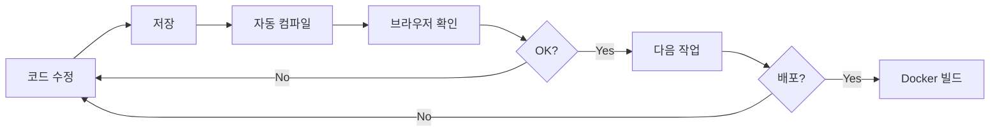

# 프론트엔드 개발 가이드

## 📋 목차
1. [개발 환경 설정](#개발-환경-설정)
2. [로컬 개발 서버 실행](#로컬-개발-서버-실행)
3. [코드 수정 및 테스트](#코드-수정-및-테스트)
4. [프로덕션 배포](#프로덕션-배포)
5. [문제 해결](#문제-해결)

---

## 개발 환경 설정

### 1. 환경 변수 설정

`.env.local` 파일이 이미 생성되어 있습니다:
```bash
NEXT_PUBLIC_API_URL=http://3.39.36.234:8080/api/v1
```

필요시 수정:
```bash
vi /home/ec2-user/DDD2/frontend/.env.local
```

### 2. 의존성 설치 (최초 1회)

```bash
cd /home/ec2-user/DDD2/frontend
npm install
```

---

## 로컬 개발 서버 실행

### 방법 1: 포트 3001 사용 (권장 - Docker와 충돌 없음)

```bash
cd /home/ec2-user/DDD2/frontend
PORT=3001 npm run dev
```

**접속 URL**: `http://3.39.36.234:3001`

### 방법 2: 기본 포트 3000 사용

먼저 Docker 컨테이너 중지:
```bash
cd /home/ec2-user/DDD2
docker-compose stop community-frontend
```

그 다음 개발 서버 실행:
```bash
cd /home/ec2-user/DDD2/frontend
npm run dev
```

**접속 URL**: `http://3.39.36.234:3000`

### 백그라운드 실행

터미널을 닫아도 계속 실행되게 하려면:
```bash
nohup PORT=3001 npm run dev > dev.log 2>&1 &
```

실행 중인 프로세스 확인:
```bash
ps aux | grep "next dev"
```

종료:
```bash
pkill -f "next dev"
```

---

## 코드 수정 및 테스트

### 🔥 Hot Module Replacement (HMR)

개발 서버 실행 중에는 **코드를 수정하고 저장하면 자동으로 브라우저에 반영**됩니다.

#### 예시 워크플로우:

1. **파일 수정**
   ```bash
   vi /home/ec2-user/DDD2/frontend/app/page.tsx
   ```

2. **저장** (vi에서 `:wq`)

3. **자동 반영 확인**
   - 터미널에 컴파일 메시지 표시
   - 브라우저 자동 새로고침 (또는 수동 새로고침)
   - 변경사항 즉시 확인

4. **재시작 불필요!** ✓


## 프로덕션 배포

### 개발 완료 후 Docker로 배포

1. **개발 서버 종료**
   ```bash
   pkill -f "next dev"
   ```

2. **Docker 이미지 재빌드 및 실행**
   ```bash
   cd /home/ec2-user/DDD2
   docker-compose up -d --build community-frontend
   ```

3. **배포 확인**
   ```bash
   docker ps | grep community-frontend
   docker logs community-platform-frontend
   ```

4. **접속 테스트**
   - URL: `http://3.39.36.234:3000`

### 빌드 없이 재시작만 (코드 변경 없을 때)

```bash
docker-compose restart community-frontend
```

---

## 문제 해결

### 포트 3001이 이미 사용 중

```bash
# 사용 중인 프로세스 확인
lsof -i :3001

# 프로세스 종료
kill -9 <PID>
```

### 개발 서버가 시작되지 않음

```bash
# node_modules 재설치
rm -rf node_modules package-lock.json
npm install

# 캐시 정리
rm -rf .next
```

### 코드 변경이 반영되지 않음

1. **브라우저 강제 새로고침**: `Ctrl + Shift + R` (또는 `Cmd + Shift + R`)
2. **개발 서버 재시작**:
   ```bash
   pkill -f "next dev"
   PORT=3001 npm run dev
   ```

### API 호출 실패 (CORS, Network Error)

`.env.local`의 API URL 확인:
```bash
cat /home/ec2-user/DDD2/frontend/.env.local
```

백엔드 서버 상태 확인:
```bash
curl http://3.39.36.234:8080/api/v1/auth/login
docker logs community-platform-api
```

### 환경 변수 변경이 반영되지 않음

`.env.local` 파일 변경 후 **반드시 개발 서버 재시작**:
```bash
pkill -f "next dev"
PORT=3001 npm run dev
```

---

## 유용한 명령어

### 로그 실시간 확인
```bash
# 개발 서버 로그
tail -f dev.log

# Docker 컨테이너 로그
docker logs -f community-platform-frontend
docker logs -f community-platform-api
```

### 전체 서비스 상태 확인
```bash
cd /home/ec2-user/DDD2
docker-compose ps
```

### 프론트엔드만 재시작
```bash
docker-compose restart community-frontend
```

### 전체 서비스 재시작
```bash
docker-compose restart
```

---

## 개발 워크플로우 요약



### 일반적인 개발 사이클

1. 개발 서버 실행 (최초 1회)
   ```bash
   PORT=3001 npm run dev
   ```

2. 코드 수정 → 저장 → 브라우저 확인 (반복)

3. 개발 완료 후 배포
   ```bash
   docker-compose up -d --build community-frontend
   ```

---

## 참고 자료

- Next.js 공식 문서: https://nextjs.org/docs
- React 공식 문서: https://react.dev
- Tailwind CSS: https://tailwindcss.com/docs
- Zustand (상태 관리): https://github.com/pmndrs/zustand

---

## 문의

개발 중 문제가 발생하면:
1. 개발자 도구 Console 확인
2. 서버 로그 확인 (`docker logs`)
3. 이 가이드의 문제 해결 섹션 참조
